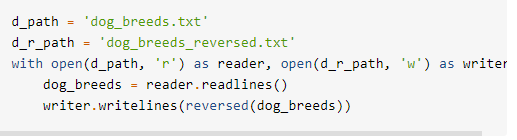
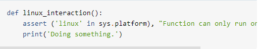

# FileIO 

**File :** is a contiguous set of bytes used to store data. This data is organized in a specific format and can be anything as simple as a text file or as complicated as a program executable.

Files usually have three parts **Header**, **Data** and **End of file**.

And what we already know about file paths (the location of a file), file name (name of this file) and file extension (the end of the file path which tells what it type).

### Opening and Closing a File in Python

* When we want to open a file we use **open** e.g " file = open('dog_breeds.txt') ", to close we use the variable name of the file with close e.g " reader.close() "

### Reading and Writing Opened Files

There is a lot of methods we can use auch as :

* **.read(size=-1)** : This reads from the file based on the number of size bytes. If no argument is passed or None or -1 is passed, then the entire file is read.

* **.readline(size=-1)** : This reads at most size number of characters from the line. This continues to the end of the line and then wraps back around. 

* **.readlines()** : This reads the remaining lines from the file object and returns them as a list.

### Working With Two Files at the Same Time

this example below it shows ho to do that :

# Exceptions

* There is a difference between Syntax and Exceptions errors.

* **exception error** type of error occurs whenever syntactically correct Python code results in an error. The last line of the message indicated what type of exception error you ran into.

### Raising an Exception

* It's when we write a code and write some of the excepted errors that might happened and let the code show it when we run it.

### The try and except Block

* is used to catch and handle exceptions. Python executes code following the try statement as a “normal” part of the program. The code that follows the except statement is the program’s response to any exceptions in the preceding try clause.

In this example we can understand try and exept block clearly:

### The else Clause

* It can instruct a program to execute a certain block of code only in the absence of exceptions.