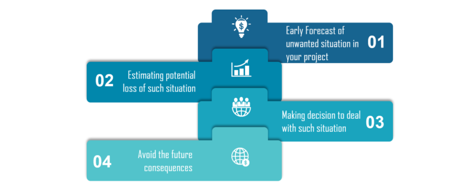

# How to use the Random Module in Python

> The random module provides access to functions that support many operations. Perhaps the most important thing is that it allows you to generate random numbers.

* The Random module contains some very useful functions such like:

**Randint** : If we wanted a random integer, we can use the randint function Randint accepts two parameters: a lowest and a highest number.

**Random**: If you want a larger number, you can multiply it.

**Choice** : Generate a random value from the sequence sequence.

**Shuffle** : shuffles the elements in list in place, so they are in a random order.

**Randrange** : Generate a randomly selected element from range(start, stop, step)

# Risk Analysis

* it helps the developers and managers to mitigate the risks. When a test plan has been created, risks involved in testing the product are to be taken into consideration along with the possibility of the damage they may cause to your software along with solutions.

* there are certain risks that are unavoidable :

1- The time that you allocated for testing

2- A defect leakage due to the complexity or size of the application

3- Urgency from the clients to deliver the project

4- Incomplete requirements

### Risk Identification 

**Business Risks**: This risk is the most common risk associated with our topic. It is the risk that may come from your company or your customer, not from your project.

**Testing Risks**: You should be well acquainted with the platform you are working on, along with the software testing tools being used.

**Premature Release Risk**: a fair amount of knowledge to analyze the risk associated with releasing unsatisfactory or untested software is required

**Software Risks**: You should be well versed with the risks associated with the software development process.

### Risk Assessment

### How to perform Risk Analysis?

* Searching the risk

* Analyzing the impact of each individual risk

* Measures for the risk identified

# Test coverage 

>  is a useful tool for finding untested parts of a codebase, it use as a numeric statement of how good your tests are.

