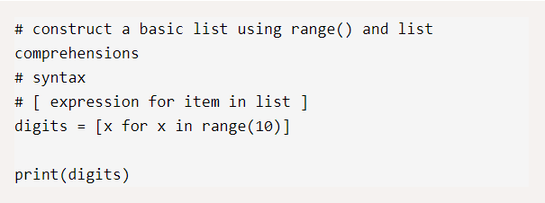

# Lists Comprehensions

> Are an elegant way to create and manage lists, more compact way of creating lists and More flexible than for loops, list comprehension is usually faster than other methods.

### Create a List with range()

* We’re using the range() method to generate a list of numbers. Python iterates(or loops) through each item in that range, and saves a copy of the item in a new list called digits.

### Lower/Upper case converter using Python

* Using list comprehension to loop through a string in Python, it’s possible to convert strings from lower case to upper case, and vice versa. 

### Print numbers only from a given string

* using  isdigit() method would separate the strings from numbers.

### Parsing a file using list comprehension

* It's possible to read files in Python using list comprehension, we can iterate through the lines of text in the file and store their contents in a new list..