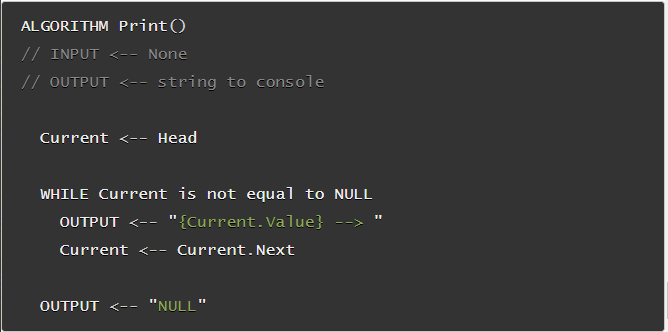

# Linked Lists

>  Is a sequence of Nodes that are connected/linked to each other. The most defining feature of a Linked List is that each Node references the next Node in the link.

* There is two types of liked lists, **Singly** and **Doubly**

* **Singly** : means that there is only one reference, and the reference points to the Next node in a linked list.

* **Doubly** : means that there is a reference to both the Next and Previous node.

### Traversal

* When traversing through a linked list, the Current variable will tell us where exactly in the linked list we are and will allow us to move/traverse forward until we hit the end.

* **How to add a new node in the first O(1)** : 

1-  instantiate the new node that we are adding,The values passed in as arguments into the Add() method will define what the value of the Node will be.

2- newNode.Next by default is set to null. We want to set newNode.Next property to the same location that the Head node is pointing towards.

3- Re-assign where Head is pointing too.

### Print Out Nodes

here is an ex: 

