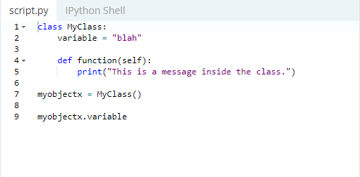
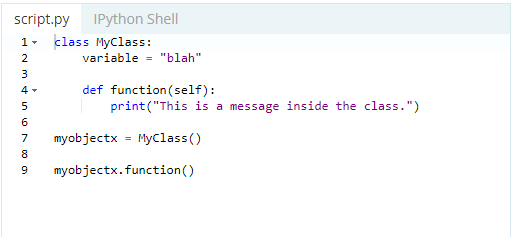

# Classes and Objects

> Objects are an encapsulation of variables and functions into a single entity. Objects get their variables and functions from classes. Classes are essentially a template to create your objects.

### Accessing Object Variables

* here is an example how to access a variable inside an object:

### Accessing Object Functions

* here is an example how to access a variable inside an object:

# Thinking Recursively in Python

* It's like finding the beat easier way to do things which will save a lot of time and power.

* Recursive function is a function defined in terms of itself via self-referential expressions, and each recursive call has its own execution context.

* **data structure is recursive** list is an example of a recursive data structure.

* Fibonacci numbers is a great example how to use a recursive function to complete it.

# Fixtures and Coverage

* **Fixtures** : we define fixtures using a combination of the pytest.fixture decorator, along with a function definition, fixtures are used differently from global variables.

* **Coverage** ( --cov) : it give you a greater degree of confidence in the code and the fact that it has been run at least once.